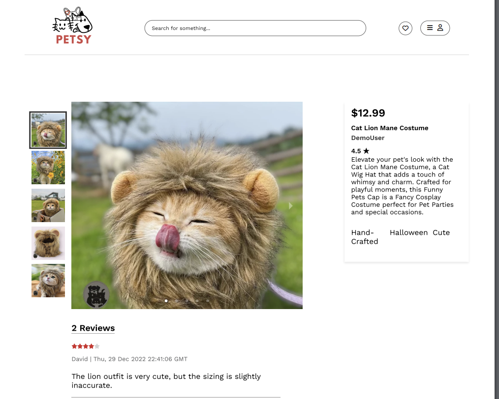

## Links to our GitHub:

https://github.com/nickhosman/Petsy

DATABASE SCHEMA: https://github.com/nickhosman/Petsy/wiki/Database-Schema

FEATURE LIST: https://github.com/nickhosman/Petsy/wiki/Feature-List

USER STORIES: https://github.com/nickhosman/Petsy/wiki/User-Stories

WIREFRAME: https://github.com/nickhosman/Petsy/wiki/Wireframe

REDUX STORE: https://github.com/nickhosman/Petsy/wiki/Redux-Store

React Components:
- DeleteProductModal()
- FavoritePage()
- Footer()
- AboutPetsyModal()
- ListingPage()
- LoginFormModal()
- LoginFormPage()
- Navigation()
- ProfileButton()
- SearchBar()
- OpenModalButton()
- ProductCard()
- ProductDetails()
- ProductFormPage()
- ProductIndex()
- ProductManage()
- ProductUpdateForm()
- CreateReview()
- DeleteReviewModal()
- ShowReviews()
- UpdateReview()
- ReviewForm()
- StarRating()
- Search()
- SignupFormModal()
- SignupFormPage()
- addTagModal()
- Tooltip()

Frontend Routes:
- listing page: '/users/:userId/products'
- Favorite page: '/users/:userId/favorites'
- Product Index: '/products'
- ProductFormPage: '/products/new'
- ProductUpdateForm: '/products/:productId/edit'
- ProductDetails : '/products/:productId'
- LoginFormPage: '/login'
- SignupFormPage: '/signup'
- Search: {`/search`}

## Getting started
Clone this repository (only this branch)

Install dependencies

      ```bash
      pipenv install -r requirements.txt
      ```

Get into your pipenv, migrate your database, seed your database, and run your Flask app

   ```bash
   pipenv shell
   ```

   ```bash
   flask db upgrade
   ```

   ```bash
   flask seed all
   ```

   ```bash
   flask run
   ```

To run the React App in development:
1. run `npm install` to install all your dependencies before starting up the application
2. While in development, run this application from this location using `npm start`.


## Name of the project: Petsy

## Link to live site: https://petsy-kn3b.onrender.com/

Summary:
Our site, Petsy, is a clone of "Etsy." It is an online platform designed specifically for our furry friends. Users can explore a wide range of products, leave reviews for items they've purchased, and curate their favorite items. The site also offers product search by name and category, making it easy for users to search for the products they're looking for. As a seller, you have the capability to create and edit product listings, as well as remove any previously listed items. Right now, Petsy offers a pet-focused experience without direct purchasing options.

APP PICTURES:





List of techs/languages/plugins/APIs used:
- Python
- Flask
- Flask-Alchemy
- Alembic
- SQLite
- SQLAlchemy
- React
- Redux
- CSS
- Javascript
- HTML
- Node


To-dos/future features:
1. Implement a shopping cart feature
2. Allow customers to purchase a product
3. Allow seller to update/delete product images when editing a product

Anything you had to stop and think about before building:
  - Our most difficult features were the search bar and tags. Our site features a search bar that allows users to find products they're looking for, so we had to plan out the logic that will allow them to do so. In addition, sellers are able to create tags for their products when they list a product; these tags are also shown in the product detail page. We had to think about how the seller can create a custom tag that is not already in the tags' list, as well as how many tags they can include for a product.


Descriptions of particular challenges:
  - The tags and search features were the most difficult. These were features that we were working on for the first time. We had to plan out how we were going to implement these, what the seller or user are allowed to do, and the purpose of it.

API DOCUMENTATION:
USERS:

## GET CURRENT USER
Require Authentication: True
Request:
  Method: GET
  Route: /api/session

Successful Response:
  Status Code: 200
  Body:
    {
    "User" : {
      "id" : 1,
      "username" : "DemoUser",
      "firstName" : "Demo",
      "lastName" : "User",
      "email" : "demouser123@aa.io"
    }
  }

## SIGN UP A USER
Requires Authentication: False
Request:
  Method: POST
  Route: /api/auth/signup
Body:
  {
    "username" : "Foobar",
    "password" : "fooword"
    "firstName" : "Foo",
    "lastName" : "Bar",
    "email": "foobar@gmail.com"
  }
Successful Response:
  Status Code: 200
  Body:
    {
      "User": {
        "id": 2,
        "username": "Foobar",
        "firstName": "Foo",
        "lastName": "Bar",
        "email": "foobar@gmail.com"
      }
  }

Error Response (Existing Username):
  Status Code: 500
  Body:
    {
      "message": "User already exists",
      "errors": {
        “username” : “User with that username already exists”
      }
    }
Error Response (Existing Email):
  Status Code: 500
  Body:
    {
      "message": "User already exists",
      "errors": {
        "email" : "User with that email already exists"
      }
    }

Error Response (Body Validation)
Status Code: 400
  Body:
  {
    "message": "Bad request",
    "errors": {
      "email" : "Invalid email",
      “username” : “Username is required”,
    “firstName” : “First name is required”,
    “lastName” : “Last name is required”
    }
  }

## LOG IN A USER

Requires Authentication: False
Request:
  Method: POST
  Route: /api/auth/login
  Body:
    {
      "email" : "demouser@appacademy.io",
      "password" : "password"
    }
Successful Response:
    Status Code: 200
    Body:
    {
      "email": "demouser@appacademy.io",
      "firstName": "Tiffany",
      "id": 1,
      "lastName": "Williams",
      "username": "DemoUser"
    }
Error Response (Invalid Credentials):
  Status Code: 401
  Body:
    {
      "errors": [
        "password : Password was incorrect."
      ]
    }
Error Response (Body Validation):
  Status Code: 400
  Body:
    {
      "errors": [
          "email : This field is required.",
          "password : This field is required."
      ]
    }


## LOG OUT A USER

Requires Authentication: True
Request:
  Method: GET
  Route: /api/auth/logout
Successful Response:
  Status Code: 200
  Body:
    {
      "message": "User logged out"
    }

PRODUCTS:

## GET ALL PRODUCTS

Requires Authentication: False
Request:
  Method: GET
  Route: /api/products

Successful Response:
  Status Code: 200
  Body:

  {
    Products : {
      “1” : {
          "id" : 1,
          “name” : “Squeaky Plush Toy”,
          “description” : “Stuffed crinkle plush octopus for teething puppies”,
          “price” : 22,
          “sellerId” : 2,
          “categoryId” : 1,
          “previewImage” : “https://i.etsystatic.com/1112_rynu.jpg”
          “createdAt” : “2022-12-13”,
          “updatedAt” : “2022-12-13”,
          “averageRating” : 3.5
        },
          ...
    }
  }

## CREATE A PRODUCT

Requires Authentication: True
Request:
  Method: POST
  Route: /api/products/new
  Body:
    {
      "name" : "Sphynx Winter Sweater",
      "description" : "Warm faux fur sweater for small cats.",
      "price" : 25,
      "category_id" : 2
    }
Successful Response:
  Status Code: 201
  Body:
  {
    "id" : 15,
    "name" : "Sphynx Winter Sweater",
    "description" : "Warm faux fur sweater for small cats.",
    "price" : 25,
    "categoryId" : 2,
    "sellerId" : 2,
    "createdAt" : "2023-01-12",
    "updatedAt" : "2023-01-12"
  }

Error Response (Body Validation):
  Status Code: 400
  Body:
  {
    "errors": [
      "name : This field is required.",
      "description : This field is required.",
      "price : This field is required.",
      "category_id : This field is required."
    ]
  }

## EDIT A PRODUCT

Requires Authentication: True
Proper Authorization: Product listing must belong to current user
Request:
  Method: PUT
  Route: /api/products/:productid/edit
  Body:
    {
      "name" : "Really Cute Sphynx Winter Sweater",
      "description" : "Really cute and warm faux fur sweater for small cats.",
      "price" : 27,
      "category_id" : 2
    }

Successful Response:
  Status Code: 200
  Body:
    {
      "categoryId": 2,
      "createdAt": "Sat, 23 Sep 2023 18:14:26 GMT",
      "description": "Really cute and warm faux fur sweater for small cats.",
      "id": 24,
      "name": "Really Cute Sphynx Winter Sweater",
      "price": "24.00",
      "sellerId": 1,
      "updatedAt": "Sat, 23 Sep 2023 18:14:26 GMT"
    }

Error Response (Body Validation):
  Status Code: 400
  Body:
    {
      "message": "Bad Request",
      "errors": {
        "name” : “Name is required”,
        “description” : “Description must be at least 30 characters”,
        “price” : “Price cannot exceed $10,000 USD”
      }
    }

Error Response (Product Not Found):
  Status Code: 404
  Body:
    {
      "message": “Product could not be found”
    }

## DELETE A PRODUCT

Requires Authentication: True
Proper Authorization: Product listing must belong to current user
Request:
  Method: DELETE
  Route: /api/products/:productid

Successful Response:
  Status Code: 200
  Body:
    {
      "message" : "Successfully deleted product"
    }

Error Response (Product Not Found):
  Status Code: 404
  Body:
    {
      "errors": {
        "Product": "Product not found"
      }
    }

## GET DETAILS OF A PRODUCT

Requires Authentication: False
Request:
  Method: GET
  Route: /api/products/:productid

Successful Response:
  Status Code: 200
  Body:
  {
    "ProductImages": [
      {
        "id": 1,
        "imageUrl": "https://i.ibb.co/whhyxQp/1.jpg",
        "preview": true,
        "productId": 1
      },
    ],
    "Seller": {
      "email": "demouser@appacademy.io",
      "firstName": "Stephanie",
      "id": 1,
      "lastName": "Harris",
      "username": "DemoUser"
    },
    "averageRating": 5.0,
    "categoryId": 1,
    "createdAt": "Sat, 23 Sep 2023 18:14:48 GMT",
    "description": "Our Sushi Snuffle Dog Toy is perfect for dog's....”,
    "id": 1,
    "name": "Handmade Sushi Dog Toy",
    "price": 25.99,
    "sellerId": 1,
    "totalReviews": 2,
    "updatedAt": "Sat, 23 Sep 2023 18:14:48 GMT"
  }

Error Response (Product Not Found):
  Status Code: 404
  Body:
    {
      "errors": {
        "Product": "Product not found"
      }
    }


## GET PRODUCT OF CURRENT USER

Requires Authentication: True
Request:
  Method: GET
  Route: /api/users/:userId/products

Successful Response:
  Status Code: 200
  Body:
    {
      "1": {
        "categoryId": 1,
        "createdAt": "Sat, 23 Sep 2023 18:14:48 GMT",
        "description": "Our Sushi Snuffle Dog Toy is perfect for dog's mental exercise. Dogs absolutely need metal exercise as much as physical exercise. An authentic realistic sushi roll design with avocado, egg, and salmon just like your favorite sushi. Plus, comes with unique gift wrap.",
        "id": 1,
        "name": "Handmade Sushi Dog Toy",
        "previewImage": "https://i.ibb.co/whhyxQp/1.jpg",
        "price": "25.99",
        "sellerId": 1,
        "updatedAt": "Sat, 23 Sep 2023 18:14:48 GMT"
      }
    }

Error Response (Not Current User):
  Status Code: 403
  Body:
    {
      "errors": "Products do not belong to User"
    }

Error Response (User Not Foundr):
  Status Code: 404
  Body:
    {
      "errors": "User not found"
    }

## CREATE AN IMAGE (FOR A PRODUCT)

Require Authentication: True
Proper Authentication: Product listing must belong to User
Request:
  Method: POST
  Route: /api/products/:productid/images (do we need the id here too?)
  Body:
    {
      "preview" : true,
      "image_url" : "https://i.etsystatic.com/5552_vodo.png",
      "product_id": 24
    }

Successful Response:
  Status Code: 200
  Body:
    {
      "id": 110,
      "imageUrl": "https://i.etsystatic.com/5552_vodo.png",
      "preview": true,
      "productId": 24
    }

Error Response (Product Not Found):
  Status Code: 404
  Body:
    {
      "message": “Product could not be found”
    }


REVIEWS:

## GET ALL REVIEWS (OF A PRODUCT)

Requires Authentication: False
Request:
  Method: GET
  Route: /api/products/:productid/reviews

Successful Response:
  Status Code: 200
  Body:
    {
      "Reviews": {
          "1": {
              "User": {
                "email": "zardys@appacademy.io",
                "firstName": "Kyle",
                "id": 20,
                "lastName": "Foster",
                "username": "Zardys"
              },
              "createdAt": "Fri, 30 Dec 2022 00:00:00 GMT",
              "details": "As someone who loves eating sushi...”,
              "id": 1,
              "productId": 1,
              "stars": 5,
              "updatedAt": "Wed, 26 Apr 2023 00:00:00 GMT",
              "userId": 20
          }
    }

Error Response (Product Not Found):
  Status Code: 404
  Body:
    {
      "message": “Product could not be found”
    }


## CREATE A REVIEW (FOR A PRODUCT)

Requires Authentication: True
Proper Authorization: User cannot create a review for a product they listed.
Request:
  Method: POST
  Route: /api/products/:productid/reviews
  Body:
    {
      "stars" : 1,
      "details" : "My wooden hamster wheel arrived with a chipped corner."
    }

Successful Response:
  Status Code: 201
  Body:
    {
      "createdAt": "Sat, 23 Sep 2023 19:35:44 GMT",
      "details": "Nice, I love this product so much",
      "id": 60,
      "productId": 24,
      "stars": 4,
      "updatedAt": "Sat, 23 Sep 2023 19:35:44 GMT",
      "userId": 1
    }

Error Response (Review Already Exists):
  Status Code: 403
  Body:
    {
      "message": “User already has a review for this product”
    }

Error Response (User Owns Product):
  Status Code: 403
  Body:
    {
      "message": “User can not review a product they listed”
    }

Error Response (Body Validation):
  Status Code: 400
  Body:
    {
      "errors": [
        "stars” : Rating is required.",
        "details” : This field is required."
      ]
    }

Error Response (Product Not Found):
  Status Code: 404
  Body:
    {
      "message": “Product could not be found”
    }

## EDIT A REVIEW

Requires Authentication: True
Proper Authorization: Review must belong to current user
Request:
  Method: PUT
  Route: /api/reviews/:reviewId
  Body:
    {
      "stars" : 4,
      "details" : "After receiving a damaged item, the seller sent me a new one!"
    }

Successful Response:
Status Code: 200
  Body:
    {
      "createdAt": "Sat, 23 Sep 2023 19:49:14 GMT",
      "details": "After receiving a damaged item, the seller sent me a new one!",
      "id": 62,
      "productId": 24,
      "stars": 4,
      "updatedAt": "Sat, 23 Sep 2023 19:49:14 GMT",
      "userId": 1
    }

Error Response (Body Validation):
  Status Code: 400
  Body:
    {
      "errors": [
        "stars” : Rating is required.",
        "details” : This field is required."
      ]
    }

Error Response (Review Not Found):
  Status Code: 404
  Body:
    {
      "error": “Review could not be found”
    }

Error Response (review is not owned by the user)
  Status code: 401 Unauthorized
  Body:
    {
      "error": “Unauthorized”
    }

## DELETE A REVIEW

Requires Authentication: True
Proper Authorization: Review must belong to current user
Request:
  Method: DELETE
  Route: /api/reviews/:reviewid

Successful Response:
  Status Code: 200
  Body:
    {
      "message" : "Successfully deleted review."
    }

Error Response (Review Not Found):
  Status Code: 404
  Body:
    {
      "error": “Review not found”
    }

CATEGORIES AND TAGS:

## GET ALL CATEGORIES

Requires Authentication: False
Request:
  Method: GET
  Route: /api/categories
Response:
  Status Code: 200
  Body:
    {
    "Categories" : {
      “1” : {
        "id" : 1,
        “name” : “Dog”
       },
        ...
      }
    }


## GET ALL TAGS

Requires Authentication: False
Request:
  Method: GET
  Route: /api/tags
Response:
  Status Code: 200
  Body:
    {
    "Tags" : {
      “1” : {
        "id" : 1,
        “name” : “Clothing”
      },
        ...
    }
  }

## CREATE A TAG (FOR A PRODUCT)

Requires Authentication: True
Proper Authorization: Product must belong to User
Request:
  Method: POST
  Route: /api/products/:productid/tags
  Body:
    {
      "name" : "Toys"
    }

Successful Response:
  Status Code: 200
  Body:
    {
      "id" : 3,
      "name" : "Toys"
    }

Error Response (Body Validation):
  Status Code: 400
  Body:
    {
      "message": "Bad Request",
      "errors": {
        “name” : “Tag name can not exceed 25 characters”
      }
    }

Error Response (Product Not Found):
  Status Code: 404
  Body:
    {
      "message": “Product could not be found”
    }

Error Response (TAG Already Exists):
  Status Code: 403
  Body:
    {
      "error": “Tag already exists for this product”
    }

FAVORITES:

## GET ALL FAVORITES (OF A USER)

Requires Authentication: True
Request:
  Method: GET
  Route: /api/users/:userid/favorites

Response:
  Status Code: 200
  Body:
    {
    "UserFavoriteProducts" : {
        {
          “id” : 4,
          "name" : "Nylon Dog Collar",
          "description" : "Custom nylon collar for dogs of all sizes!",
          "price" : 10,
          "sellerId" : 2,
          "categoryId" : 1,
          "previewImage" : "https://i.etsystatic.com/1243_inde.jpg"
          "createdAt" : "2022-12-01",
          "updatedAt" : "2022-12-01"
        }
      },
        ...
    }
  }

Error Response (User Not Found):
  Status Code: 404
  Body:
    {
      "message": “User could not be found”
    }

## CREATE A FAVORITE (PRODUCT)

Requires Authentication: True
Proper Authorization: User cannot favorite a product they listed
Request:
  Method: POST
  Route: /api/users/:userid/favorites
  Body:
    {
      "userId" : 1,
      "productId" : 1
    }

Response:
  Status Code: 200
  Body:
    {
      "message" : "Successfully added to favorites."
    }

Error Response (User Already Favorited):
  Status Code: 500
  Body:
    {
      "message": “User already favorited product”
    }

Error Response (User Owns Product):
  Status Code: 500
  Body:
    {
      "message": “User can not favorite a product they listed”
    }

## DELETE A FAVORITE (PRODUCT)

Requires Authentication: True
Request:
  Method: DELETE
  Route: /api/favorites/:favoriteid

Successful Response:
  Status Code: 200
  Body:
    {
      "message" : "Successfully removed from favorites."
    }


Error Response (Favorite Not Found):
  Status Code: 404
  Body:
    {
      "message": “Favorite product could not be found”
    }

Error Response (User Not Found):
  Status Code: 404
  Body:
    {
      "message": “User could not be found”
    }
