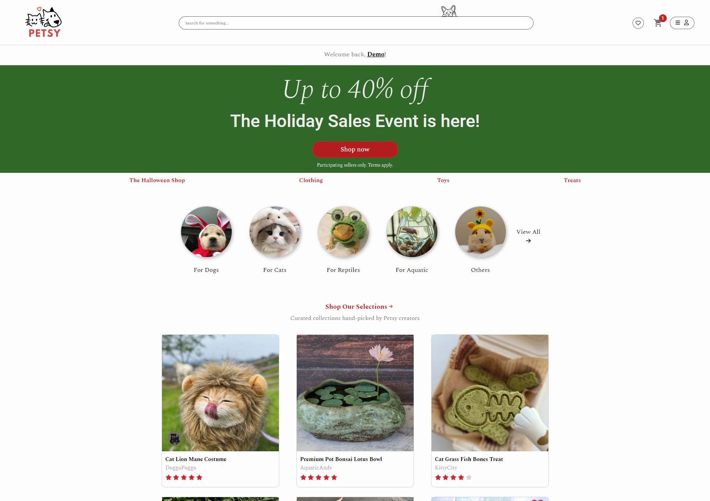
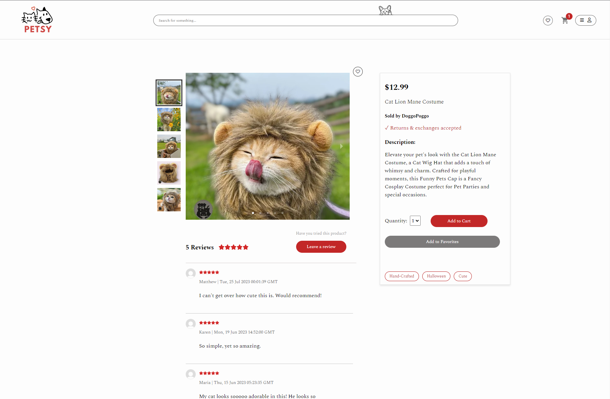
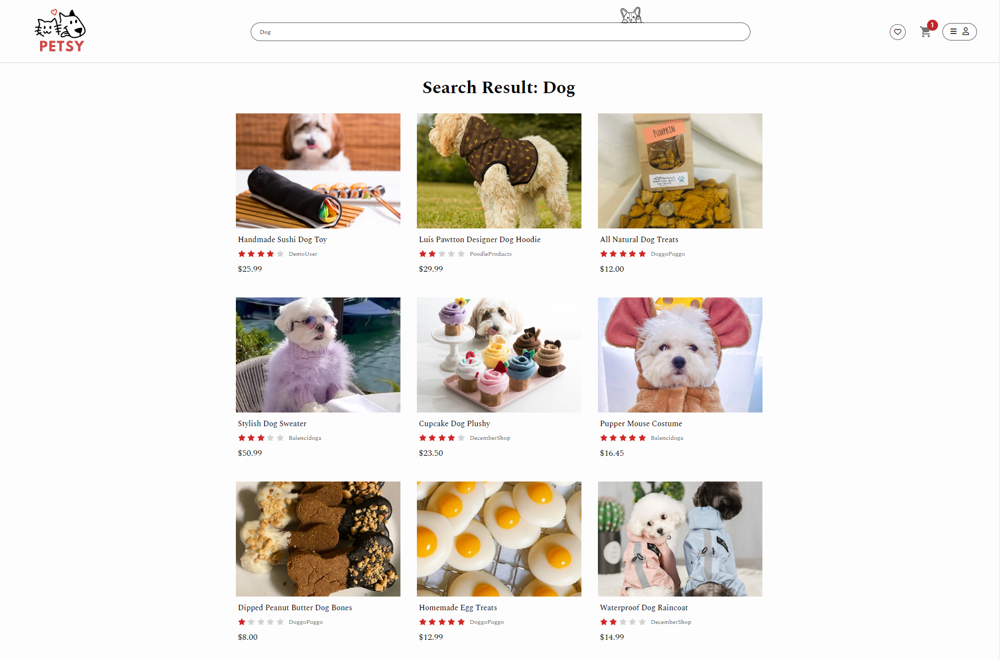
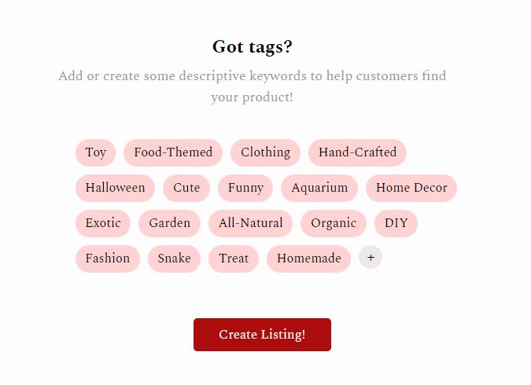

## Summary:
Petsy is an online catalogue browsing website that offers custom handcrafted products for all types of pets! As a passionate team of pet lovers, we strive to provide our furry friends unique gifts with the best comfort and style. Users can browse a wide variety of products, leave reviews for items they've purchased, and curate a list of their own favorite items. Finding a product for your pet has never been easier thanks to the search and tag feature! As a seller, you have the capability of creating and editing your product listings, as well as removing any previously listed items.

https://petsy-kn3b.onrender.com/

## Technologies Used
Backend: Flask, SQLAlchemy

Frontend: React, Redux

Database: PostgreSQL

Hosting: Render

## Landing Page

## Product Page

## Search Products

## Tag Products

## Next Features (In Progress)
1. Shopping cart feature that allows user to add products into their cart and complete purchases.
2. Allow seller to update/delete product images when for their listings.

## Wiki Pages

### Home (About):

https://github.com/nickhosman/Petsy

### Database Schema:

https://github.com/nickhosman/Petsy/wiki/Database-Schema

### Wireframe:

https://github.com/nickhosman/Petsy/wiki/Wireframe

### API Backend Routes:

https://github.com/nickhosman/Petsy/wiki/Backend-Routes

### User Stories:

https://github.com/kevindbaik/Rishy/wiki/User-Stories
